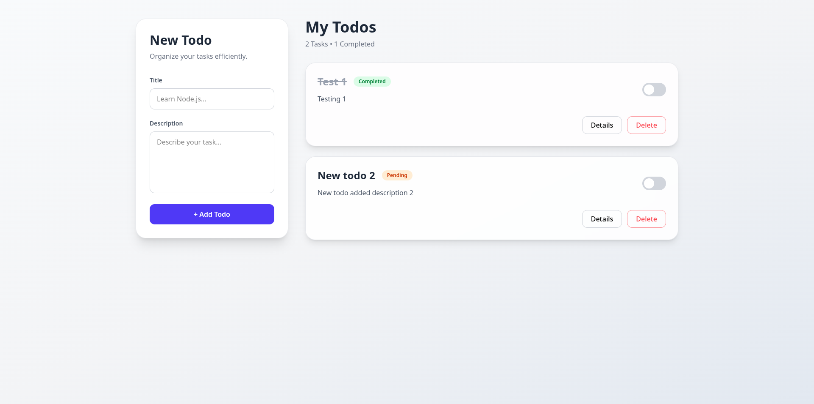
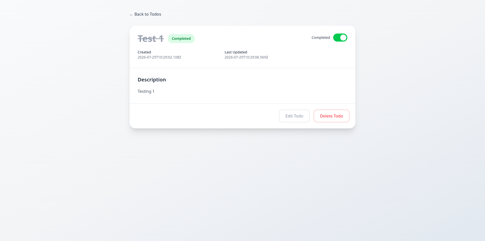

# Todo Application

A basic simple full-stack Todo Application built as part of a coding challenge. The application allows users to create, manage, update, and delete todos with a clean, responsive React frontend and a RESTful Express.js backend powered by MongoDB.

---

# Live Demo

### Frontend

https://ziptrrip-bice.vercel.app/todos

### Backend API

https://ziptrrip-backend.vercel.app/api/v1/todo/

---

# 🛠️ Tech Stack

## Frontend

- React
- React Router
- Vite
- Tailwind CSS
- Axios

## Backend

- Node.js
- Express.js
- MongoDB
- Mongoose
- CORS
- dotenv

---

# 📂 Project Structure

```text
ZIPTRIP/
├── Backend/
│   ├── controllers/
│   ├── models/
│   ├── routes/
│   ├── services/
│   ├── config/
│   ├── server.js
│   └── package.json
│
├── Frontend/
│   ├── src/
│   ├── public/
│   ├── vite.config.js
│   └── package.json
│
├── docs/
│   ├── API.md
│   ├── FRONTEND.md
│   └── SETUP.md
│
└── README.md
```

---

# Features

## Todo List

- View all todos
- Create a new todo
- Edit existing todos
- Delete todos
- Mark todos as completed
- Responsive UI
- Real-time API integration

## Todo Details

- View complete information for a single todo
- Dynamic route using Todo ID
- Displays:
  - Title
  - Description
  - Completion Status
  - Created Date
  - Last Updated Date

---

# 📡 REST API

Base URL

```
https://ziptrrip-backend.vercel.app/api/v1/todo
```

| Method | Endpoint | Description       |
| ------ | -------- | ----------------- |
| GET    | `/`      | Get all todos     |
| GET    | `/:id`   | Get a todo by ID  |
| POST   | `/`      | Create a new todo |
| PUT    | `/:id`   | Update a todo     |
| DELETE | `/:id`   | Delete a todo     |

---

# ⚙️ Getting Started

## 1. Clone the Repository

```bash
git clone https://github.com/ansh307/ziptrip.git
cd ZIPTRIP
```

---

## 2. Backend Setup

```bash
cd Backend
npm install
```

Create a `.env` file inside the Backend folder.

```env
PORT=5000
MONGODB_URI=your_mongodb_connection_string
```

Run the backend:

```bash
npm run dev
```

---

## 3. Frontend Setup

```bash
cd Frontend
npm install
```

Create a `.env` file.

```env
VITE_API_URL=http://localhost:5000/api/v1/todo
```

Run the frontend:

```bash
npm run dev
```

---

# 🌐 Deployment

| Service  | URL                                              |
| -------- | ------------------------------------------------ |
| Frontend | https://ziptrrip-bice.vercel.app/todos           |
| Backend  | https://ziptrrip-backend.vercel.app/api/v1/todo/ |

---

# 📚 Documentation

Detailed project documentation is available in the **docs/** directory.

```text
docs/
├── API.md
├── BACKEND.md
└── SETUP.md

and

~/README.md
```

---

# 🎯 Challenge Requirements

- ✅ Multiple-page React application
- ✅ Todo List page
- ✅ Single Todo Details page
- ✅ Full CRUD functionality
- ✅ RESTful API
- ✅ MongoDB integration
- ✅ Responsive UI
- ✅ Proper project documentation

---

# 📸 Screenshots

Example:

```markdown



```

---

# 👨‍💻 Author

**Ansh Soni**

GitHub: https://github.com/ansh307
